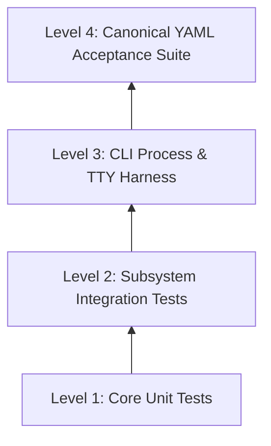

# Snap (Rust) — High-Level Implementation Plan & Architecture Roadmap

## 1. Executive Summary & Architectural Goals

Snap is a lightweight, local-first version control system designed around causal vector-clock versions, deterministic patch replay, operational transformation (OT), and automatic merge resolution. Unlike traditional commit-graph or tree-snapshot VCS systems (e.g., Git), Snap models history as a causally closed, immutable set of authored patches, where any materializable version corresponds to a unique deterministic replay of changes from an empty root.

The primary architectural goals for the Rust implementation are:
- **Absolute Determinism:** Replaying identical patch sets and frontiers must produce bit-for-bit identical filesystem materializations, diff outputs, and warning sequences across all platforms.
- **Strict Separation of Pure Logic and I/O:** Core causal modeling, diff calculation, operational transformation, repository validation, and replay are strictly isolated as pure, deterministic components, completely decoupled from filesystem mutations, network I/O, and process environments.
- **Strict Spec Conformance & Zero-Tolerance Validation:** Every schema constraint, numeric bound, path invariant, and ordering requirement specified in `SPEC.md` must be enforced defensively before performing any in-memory or on-disk mutation.
- **Robust Atomicity & Working Tree Safety:** Working-tree files and repository metadata must never enter an inconsistent state. Repository updates use atomic directory-local replacements, and uncommitted or unsupported working tree modifications prevent destructive commands.
- **Fidelity of Interactive Presentation:** Seamless duality between byte-stable plain output for automated pipelines and rich ANSI terminal presentation for human operators, managed centrally without polluting command business logic.

---

## 2. System Architecture & Component Design

The system follows a layered, hexagonal-style architecture where the core domain logic is entirely agnostic of the operating system, terminal, and network.

```mermaid
graph TD
    CLI[CLI Entry Point & Argument Dispatch] --> Presentation[Presentation & ANSI Engine]
    CLI --> CommandLayer[Command Handlers Layer]
    
    subgraph Core Domain [Pure & Deterministic Core]
        VersionClock[Version & Contributor Algebra]
        DiffOT[Tokenization, Canonical Diff & OT]
        RepoModel[Patch & Repository Schema Model]
        Validation[Repository & Graph Validator]
        ReplayEngine[Deterministic Replay & Namespace Resolver]
    end

    subgraph I/O & Platform Adaptors [System & Network Boundary]
        FSScanner[Working Tree Scanner & Path Validator]
        FSMaterializer[Atomic Filesystem Materializer]
        ConfigStore[Local & Global Config Loader]
        HttpService[HTTP Server Snapshot & Client Fetcher]
    end

    CommandLayer --> Core Domain
    CommandLayer --> I/O & Platform Adaptors
    ReplayEngine --> DiffOT
    ReplayEngine --> VersionClock
    Validation --> ReplayEngine
    Validation --> RepoModel
```

### 2.1 Core Architectural Subsystems

1. **Version & Causal Order Engine:**
   - Handles parsing, canonical string formatting, four-way causal comparisons (Equal, Before, After, Concurrent), join operations (element-wise maximums), and Snap total ordering across contributor counters.
   - Enforces integer range boundaries (bounded by JavaScript maximum safe integer limits) and strict lexicographic contributor ordering.

2. **Text Diff & Operational Transformation Engine:**
   - Provides canonical tokenization (splitting files immediately after LF bytes and preserving LF).
   - Implements the exact recurrence relation and deletion-on-tie rule for token diffs without heuristic variations.
   - Houses the stream-based Operational Transformation (OT) engine that transforms incoming patches against aggregate context edits, handling token count splitting and operation coalescing.

3. **Repository Graph & Schema Validation:**
   - Validates JSON schemas, dot uniqueness, contributor serial continuity, and causal closures.
   - Performs cycle detection and topological sorting to guarantee that no patch is integrated before its complete base is materialized.

4. **Replay & Namespace Resolution Engine:**
   - Reconstructs arbitrary versions from the empty tree by progressively integrating ready patches according to Snap order.
   - Evaluates multi-path namespace conflicts (prefix-freedom) and path-level conflict policies (`delete-wins`, `later-create-wins`, `later-put-wins`, `put-wins`, `namespace-wins`).
   - Tracks and sorts auto-resolution warnings, filtering joined warnings against pre-merge warnings during merge operations.

5. **Filesystem Materialization & Working Tree Scanner:**
   - Scans working directories while checking for illegal segments, unsupported file types (symlinks, devices, pipes), and control characters.
   - Materializes target path-byte maps by removing blocking paths, creating necessary parent directories, writing target files, and pruning empty directories.
   - Enforces atomic metadata replacement using temporary files within `.snap/`.

6. **Presentation & Formatting Engine:**
   - Evaluates environmental flags (`SNAP_COLOR` and `NO_COLOR`) and stream TTY status to choose between Plain Mode and Terminal Mode.
   - Translates domain events, diffs, status records, and logs into ANSI-styled terminal buffers or byte-stable plain streams.

7. **HTTP Service & Network Client:**
   - Provides a lightweight, read-only HTTP server serving a frozen repository snapshot at `/repository.json` with appropriate headers, status codes, and graceful signal termination.
   - Handles synchronous HTTP fetching for remote repository operands during diff and merge operations.

---

## 3. Technology Stack & Rust Dependency Choices

The implementation utilizes modern Rust (2021 edition) targeting native stability, safety, and zero unneeded runtime overhead. The external crate footprint is kept intentionally minimal to prevent unwanted transitive behaviors, preserve strict deterministic execution, and ensure fast compilation times.

- **Language & Toolchain:** Rust 2021 edition, managed via Cargo.
- **CLI Parsing:** Hand-crafted, zero-dependency positional and option scanner.
  - *Rationale:* Snap has rigid grammar rules (exact argument positioning, no loose flag reordering, strict mutual exclusivity, exact subcommands, and precise error formatting). Off-the-shelf CLI frameworks frequently introduce automatic help flags, non-canonical option reordering, or error messages that diverge from the specification.
- **Serialization & JSON Handling:** `serde` and `serde_json`.
  - *Rationale:* High performance and robust serialization. Custom deserializers and strict schema visitors will be utilized to reject duplicate object keys, disallow unknown fields, enforce arbitrary-precision integer checks up to 9007199254740991, and guarantee two-space indentation with trailing newlines.
- **Binary Encoding:** `base64`.
  - *Rationale:* RFC 4648 standard padded base64 encoding/decoding for `put` file changes.
- **TTY & Terminal Detection:** `is-terminal` (or standard library `IsTerminal`).
  - *Rationale:* Cross-platform detection of stdout/stderr TTY status to satisfy `SNAP_COLOR=auto` rules.
- **HTTP Server & Client:** Standard library `std::net` combined with a minimal HTTP parsing layer (`httparse`) or a lightweight blocking client (`ureq`).
  - *Rationale:* Snap's network surface is completely synchronous and minimal (serving a single read-only static JSON file on `127.0.0.1` and issuing single GET requests to remote endpoints). Introducing a full asynchronous runtime (like Tokio) would introduce unnecessary complexity, background worker threads, and binary bloat.
- **Signal Handling:** `ctrlc` or standard Unix signal handling for clean shutdown of the HTTP server upon SIGINT/SIGTERM.

---

## 4. Code Organization & Major Files

All implementation files will reside under the `rust/` directory. Responsibilities will be strictly partitioned into modular components corresponding to the specification boundaries:

```text
rust/
├── Cargo.toml
├── Cargo.lock
└── src/
    ├── main.rs                 # CLI entry point, exit code handling, top-level dispatch
    ├── cli/
    │   ├── mod.rs              # CLI grammar definitions and dispatch coordination
    │   ├── args.rs             # Strict positional argument and flag parser
    │   └── commands.rs         # Command handlers for each of the snap subcommands
    ├── core/
    │   ├── mod.rs              # Core module exports
    │   ├── version.rs          # Contributor IDs, vector clocks, causal comparisons, Snap order
    │   ├── patch.rs            # Patch schema, edit scripts, change variants (text, put, delete)
    │   ├── diff.rs             # Tokenization and canonical dynamic-programming diff algorithm
    │   ├── ot.rs               # Operational transformation matrix and edit script application
    │   ├── replay.rs           # Deterministic replay engine, patch scheduler, path conflict rules
    │   └── validation.rs       # Invariant validation, base closure checking, cycle detection
    ├── fs/
    │   ├── mod.rs              # Filesystem abstractions and path validations
    │   ├── paths.rs            # Tracked path validation, segment prefix-freedom checks, UTF-8 sorting
    │   ├── scanner.rs          # Working tree scanner, clean/dirty detection, unsupported entry detection
    │   └── materializer.rs     # Safe atomic filesystem materialization and metadata replacement
    ├── config/
    │   ├── mod.rs              # Configuration loader and writer
    │   └── model.rs            # Local (.snap/config.json) and global (~/.snapconfig.json) schema
    ├── http/
    │   ├── mod.rs              # HTTP subsystem facade
    │   ├── server.rs           # Read-only snapshot HTTP server (127.0.0.1) and signal listener
    │   └── client.rs           # Read-only remote repository fetcher
    └── presentation/
        ├── mod.rs              # Terminal presentation facade and color mode negotiation
        ├── ansi.rs             # ANSI SGR styling utilities and symbol formatting
        └── formatters.rs       # Dedicated formatters for status, log, diff, warnings, and errors
```

### 4.1 Detailed Responsibilities of Major Files

- **`src/main.rs`:**
  Initializes process environment, intercepts top-level flags, invokes the presentation negotiator, dispatches parsed commands to handlers, and maps domain errors to exit codes (0 for success, 1 for domain/operational errors, 2 for unexpected internal failures).

- **`src/cli/args.rs` & `src/cli/commands.rs`:**
  Enforces exact command grammar, checks for trailing operands or unexpected flags, locates the nearest `.snap` directory by traversing parent paths, and coordinates domain workflows for all commands (`init`, `config`, `status`, `log`, `commit`, `diff`, `revert`, `merge`, `--serve`, `--version`).

- **`src/core/version.rs`:**
  Models contributor email identities and vector clock mappings. Implements strict ASCII validation, canonical text serialization `(id->rev,...)`, deserialization, four-way causal relations, join operations, and the total Snap ordering rule.

- **`src/core/patch.rs`:**
  Defines strongly-typed data structures for the repository envelope, patches, text edit operations (`retain`, `delete`, `insert`), atomic `put` operations, and deletions. Enforces JSON serialization invariants (two-space indentation, key ordering, and canonical format).

- **`src/core/diff.rs`:**
  Contains the token splitter (LF-preserving text tokens) and executes the canonical diff recurrence relation `D(i, j)` with deletion-on-tie prioritization, producing minimal coalesced edit scripts.

- **`src/core/ot.rs`:**
  Implements the pairwise operational transformation table for concurrent edit scripts against aggregate context diffs, managing token splitting and preservation of concurrent insertions.

- **`src/core/replay.rs`:**
  Implements topological patch scheduling based on base readiness and Snap order. Evaluates tree-level and namespace conflicts, executes path-level resolution policies, and maintains ordered auto-resolution warning logs.

- **`src/core/validation.rs`:**
  Performs complete pre-mutation repository validation: verifies causality acyclicity, patch dot uniqueness, contiguous revisions per contributor, base closure completeness, and base tree replay validity.

- **`src/fs/paths.rs` & `src/fs/scanner.rs`:**
  Enforces strict UTF-8 path rules (no backslashes, no relative navigation segments, no control characters, no leading `.snap`). Scans the active working directory, compares file states against the current tree to detect additions, modifications, and deletions, and errors immediately upon encountering symlinks or special devices.

- **`src/fs/materializer.rs`:**
  Translates a target tree into filesystem changes. Writes files, removes obsolete paths, deletes newly emptied directories, and writes `repository.json` atomically via temporary files in `.snap/`.

- **`src/config/model.rs` & `src/config/mod.rs`:**
  Reads and writes local `.snap/config.json` and global `$HOME/.snapconfig.json`, enforcing schema compliance and contributor ID validation.

- **`src/http/server.rs` & `src/http/client.rs`:**
  Manages read-only HTTP operations. The server freezes the validated repository state at startup, binds to the requested port on localhost, prints the resolved URL to standard output, serves `GET` and `HEAD` requests for `/repository.json`, and terminates cleanly on interrupt signals. The client safely retrieves remote repository JSON documents over HTTP/HTTPS.

- **`src/presentation/ansi.rs` & `src/presentation/formatters.rs`:**
  Encapsulates all visual rendering rules. Inspects `SNAP_COLOR` and `NO_COLOR` alongside stream TTY status. Formats success checks, error crosses, warning badges, status markers, commit logs, and colored unified diffs with exact ANSI codes.

---

## 5. Testing Hierarchy & Verification Strategy

Snap’s verification architecture is structured into four distinct, cumulative tiers. Each tier validates specific stability guarantees, from low-level mathematical invariants up to black-box process-level acceptance.



### 5.1 Testing Levels (Hierarchy)

1. **Level 1: Low-Level Domain Unit Tests (In-Process)**
   - Focused on pure functions and algebraic invariants.
   - Executes with `cargo test` in memory without filesystem or network dependencies.
   - Covers version comparisons, vector clock joins, tokenization boundaries, dynamic programming diff recurrence, and OT transformation matrices.

2. **Level 2: Subsystem Integration Tests (In-Process with Virtual/Temp Filesystem)**
   - Tests multi-component interactions within isolated temporary directories.
   - Validates repository validation pipelines, multi-patch replay convergence, namespace conflict resolution, working tree change detection, and atomic file materialization.

3. **Level 3: CLI & TTY Subprocess Tests (End-to-End In-Rust)**
   - Executes the compiled `snap` binary across varied simulated terminal environments.
   - Tests parameter edge cases, exit codes, signal handling for `--serve`, and TTY-independent presentation fallbacks for `SNAP_COLOR=auto`, `always`, and `never`.

4. **Level 4: Canonical Language-Neutral Acceptance Suite (External Black-Box Harness)**
   - The authoritative product contract driven by `verify --lang rust` using the YAML-driven harness in `test-harness/`.
   - Exercises end-to-end multi-repository synchronization, cross-process execution, HTTP exchange, and byte-for-byte terminal and plain output assertions.

---

## 6. Functional & Regression Testing Domains

Testing is structured into twelve distinct functional domains. Comprehensive test scenarios for each domain will be detailed in the upcoming `test-scenarios.md` specification document.

### Domain A: Version Algebra & Contributor Identity
- **Scope:** Contributor ID syntactic validation, revision numeric boundaries, canonical text serialization, four-way causal comparisons, vector clock joins, and total Snap ordering.
- **Regression Areas:** Malformed email strings, spaces in version strings, leading zeroes, duplicate contributor entries, integer overflow beyond safe bounds, and concurrent vector clock comparisons.

### Domain B: Repository Schema & Graph Invariant Validation
- **Scope:** Validation of `.snap/repository.json` structure, JSON key uniqueness, integer constraints, serial contributor sequencing, base closure reachability, and causal acyclicity.
- **Regression Areas:** Rejection of unknown JSON fields, floating-point numbers, missing base patches, out-of-order patches, disconnected causal chains, and duplicate dot collisions with differing payloads.

### Domain C: Tokenization & Canonical Diff Algorithm
- **Scope:** Splitting text files into newline-retaining tokens, empty file handling, binary detection (presence of NUL or non-UTF8 bytes), and computation of minimum edit scripts via canonical dynamic programming.
- **Regression Areas:** Strict deletion-on-tie behavior, handling files without trailing newlines, repeated identical lines, and coalescing of contiguous edit operations.

### Domain D: Operational Transformation (OT) Engine
- **Scope:** Transformation of incoming text edit scripts against aggregate context diffs, preservation of concurrent inserts, and token count splitting.
- **Regression Areas:** Concurrent inserts at the identical cursor location, overlapping delete-retain operations, scripts consuming base tokens of differing lengths, and transformations against complex multi-line edits.

### Domain E: Deterministic Replay & Conflict Policies
- **Scope:** Replay scheduling by Snap order, patch readiness queues, namespace collision resolution (`namespace-wins`), and path-level conflict policies (`delete-wins`, `later-create-wins`, `later-put-wins`, `put-wins`).
- **Regression Areas:** Replay convergence under patch reordering, file-to-directory namespace transitions, identical concurrent change deduplication, and deterministic ordering of auto-resolution warnings.

### Domain F: Filesystem Scanning & Safe Materialization
- **Scope:** Relative path normalization, unsigned UTF-8 path sorting, segment prefix-freedom enforcement, detection of dirty working trees, and atomic filesystem updates.
- **Regression Areas:** Prevention of directory traversal via `..` or symlinks, rejection of non-regular files, cleanup of empty intermediate directories, and atomic rollback/safety of metadata during write errors.

### Domain G: Configuration Resolution
- **Scope:** Local `.snap/config.json` precedence over global `$HOME/.snapconfig.json`, contributor identity extraction, and strict configuration validation.
- **Regression Areas:** Missing `$HOME` variable handling, malformed configuration files, unknown configuration fields, and refusal of commit/revert operations when identity is absent.

### Domain H: CLI Dispatch & Grammar Enforcement
- **Scope:** Exact positional argument dispatch, detection of extraneous parameters, unknown flags, and repository discovery by directory traversal.
- **Regression Areas:** Arguments passed in non-standard positions, subcommands executed outside a repository, ambiguous invocation syntax, and exact exit code mapping (0, 1, and 2).

### Domain I: Terminal Presentation & Output Formatting
- **Scope:** Negotiation between Plain Mode and Terminal Mode via `SNAP_COLOR` and `NO_COLOR`, ANSI color sequence generation, structured status formatting, diff line styling, and log output.
- **Regression Areas:** Byte-stable output in piped environments, strict override behavior of `SNAP_COLOR=always` over `NO_COLOR`, exact ANSI code emission, and formatting of warning/error indicators.

### Domain J: HTTP Repository Service & Client Fetcher
- **Scope:** Embedded read-only HTTP server binding to `127.0.0.1`, endpoint routing (`GET`/`HEAD` on `/repository.json`), snapshot isolation, graceful shutdown on SIGINT/SIGTERM, and HTTP repository URL fetching.
- **Regression Areas:** Method rejection (405 for POST/PUT), route rejection (404 for arbitrary paths), port 0 dynamic allocation, and connection failure handling on remote diff/merge.

### Domain K: Multi-Repository Synchronization & Convergence
- **Scope:** Two-way and three-way merges, unioning patch closures, frontier joins, cross-repository diff calculations, and warning log diffing (new warnings only).
- **Regression Areas:** Merge commutativity and associativity (identical joined state regardless of merge direction or order), re-merging existing history as a no-op, and cross-repository dot collision detection.

### Domain L: Fault Tolerance & State Protection
- **Scope:** Dirty tree protection during merge/revert, validation-before-mutation guarantees, and preservation of existing files upon command errors.
- **Regression Areas:** Aborting operations prior to modifying files if validation fails, atomic replacement of `repository.json`, and refusal to overwrite uncommitted working tree edits.

---

## 7. Phased Implementation Roadmap

The implementation will proceed through nine sequential phases, building up from foundational data structures to end-to-end integration and verification.

```mermaid
gantt
    title Snap (Rust) Implementation Roadmap
    dateFormat  X
    axisFormat %s
    
    section Foundation
    Phase 1: Project Setup & Version Algebra         :p1, 0, 1
    Phase 2: Repository Format & Canonical Diff       :p2, after p1, 1
    
    section Engine Core
    Phase 3: Replay Engine, OT & Conflict Rules       :p3, after p2, 2
    Phase 4: Filesystem Scanner & Materializer        :p4, after p3, 2
    
    section CLI & Features
    Phase 5: Config & Core Local Commands             :p5, after p4, 2
    Phase 6: Replay Commands (Diff, Revert, Merge)   :p6, after p5, 2
    Phase 7: HTTP Server Snapshot & Client           :p7, after p6, 1
    
    section Polish & Conformance
    Phase 8: Terminal Presentation & ANSI Engine      :p8, after p7, 1
    Phase 9: Acceptance Suite Verification & Hardening:p9, after p8, 1
```

### Phase 1: Cargo Workspace Initialization & Version Algebra
- **Objectives:**
  - Initialize the `rust/` Cargo package with necessary dependencies (`serde`, `serde_json`, `base64`, `is-terminal`, `httparse`).
  - Implement contributor ID parsing, validation, and serialization.
  - Implement vector clocks, canonical string parsing `(...)`, four-way causal comparisons, vector joins, and Snap total ordering.
- **Verification Gate:** Level 1 unit tests covering all version comparison permutations and ordering laws.

### Phase 2: Repository Data Model & Canonical Text Diff
- **Objectives:**
  - Define strongly typed structures for patches, edit scripts, `put`, and `delete` changes.
  - Implement JSON serialization with strict validation (two-space indentation, unique keys, safe integer limits).
  - Implement UTF-8 tokenization with newline retention.
  - Implement the exact canonical dynamic programming diff recurrence `D(i, j)` with deletion-on-tie prioritizing.
- **Verification Gate:** Verification against canonical text diff fixtures and JSON serialization golden files.

### Phase 3: Operational Transformation & Deterministic Replay Engine
- **Objectives:**
  - Implement pairwise text OT for transforming incoming edit scripts against aggregate context diffs.
  - Build the topological patch scheduler (resolving patch readiness by base closure and Snap order).
  - Implement namespace collision resolution (`namespace-wins`) and path-level conflict rules (`delete-wins`, `later-create-wins`, `later-put-wins`, `put-wins`).
  - Implement full repository validation (acyclicity, dot uniqueness, serial continuity).
- **Verification Gate:** In-process multi-patch replay tests demonstrating convergence across patch permutation orders.

### Phase 4: Filesystem Scanner, Path Validation & Materializer
- **Objectives:**
  - Implement UTF-8 path validation (rejection of control characters, backslashes, empty segments, `.`, `..`, `.snap` prefix).
  - Implement segment prefix-free invariant verification.
  - Implement working tree scanner with clean/dirty detection and symlink/unsupported entry rejection.
  - Implement atomic filesystem materialization (directory tree restructuring and atomic `repository.json` replacement).
- **Verification Gate:** Filesystem tests asserting dirty tree detection, symlink rejection, and atomic replacement safety.

### Phase 5: Configuration & Core Local Commands
- **Objectives:**
  - Implement local (`.snap/config.json`) and global (`$HOME/.snapconfig.json`) configuration resolution.
  - Implement strict CLI argument parsing without external grammar-loosening frameworks.
  - Implement core local commands: `init`, `config`, `status`, `log`, and `commit`.
- **Verification Gate:** Successful execution of public YAML acceptance tests `01-init.yaml` through `04-commit-status-log.yaml`.

### Phase 6: Advanced Replay Commands (`diff`, `revert`, `merge`)
- **Objectives:**
  - Implement working tree vs current tree diff, and version-to-version diff.
  - Implement unified-style diff formatting (with `/dev/null` for absent files and binary markers).
  - Implement `revert` command with target verification, dirty-tree rejection, and additive patch creation.
  - Implement `merge` command with patch unioning, frontier joins, full replay, dirty-tree checks, and warning diff filtering.
- **Verification Gate:** Passing acceptance tests for diff goldens, revert, merge conflicts, and namespace conflicts (`05` through `11`).

### Phase 7: HTTP Server Snapshot & HTTP Client
- **Objectives:**
  - Implement frozen-in-memory repository snapshot server on `127.0.0.1` supporting `GET` and `HEAD` requests for `/repository.json`.
  - Handle ephemeral port allocation (port 0) and stdout announcement.
  - Implement signal handling for graceful shutdown on SIGINT/SIGTERM.
  - Implement read-only remote HTTP repository fetching for diff and merge operations.
- **Verification Gate:** Passing acceptance tests for HTTP server and client operations (`12-http-server.yaml` and `13-http-client.yaml`).

### Phase 8: Terminal Presentation Engine & Color Negotiation
- **Objectives:**
  - Implement presentation mode negotiation based on `SNAP_COLOR`, `NO_COLOR`, and TTY state.
  - Implement terminal formatters for status, log, diff, warnings, and errors with exact ANSI SGR escape codes.
  - Ensure byte-stable plain output is strictly preserved when redirected or when plain mode is selected.
- **Verification Gate:** Passing acceptance tests for terminal presentation and color negotiation (`28-terminal-presentation.yaml`).

### Phase 9: End-to-End Hardening & Acceptance Suite Conformance
- **Objectives:**
  - Run the complete shared YAML acceptance suite (`verify --lang rust`).
  - Address edge-case matrices: strict schema validation, CLI grammar permutations, version boundary conditions, and portability.
  - Profile and optimize memory usage during replay and diff operations.
- **Verification Gate:** 100% pass rate across all 28 YAML acceptance test suites in `tests/`.

---

## 8. Alignment with Separate Test Scenarios Specification

This implementation plan focuses exclusively on structural architecture, code modularity, technology decisions, major files, testing hierarchy, and the operational roadmap. Detailed behavioral test scenarios, concrete edge case permutations, golden assertions, and specific test vectors will be formalized separately in `test-scenarios.md` as cross-referenced in Section 6.
